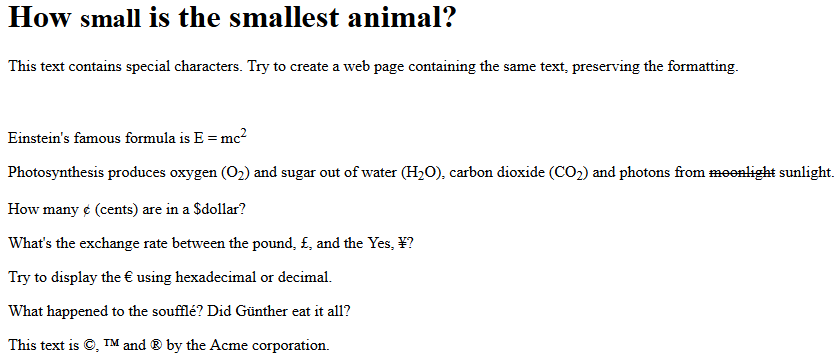
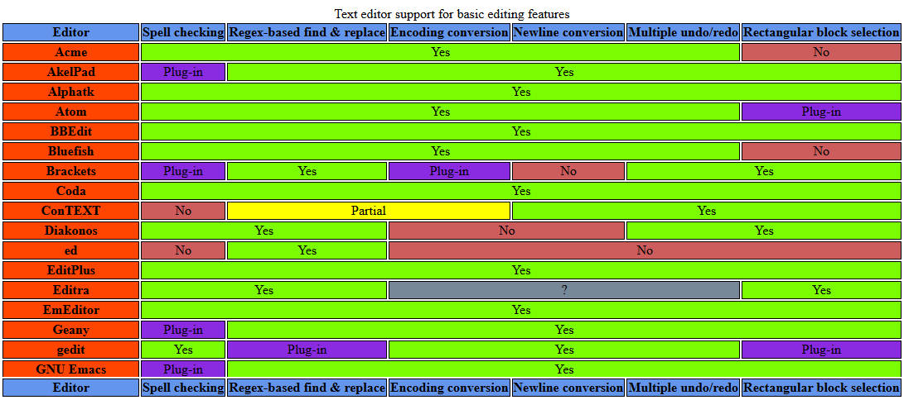

Web Lab 01 &ndash; HTML &amp; Git
==========


Preamble
--------

Before you can use git, you first need to configure it so that it knows who you are, and what editors to use. Begin by opening an external terminal window, then using the provided Git Quick Reference document, configure your username, email and editor for git. 

**IMPORTANT NOTE**: Do not copy and paste code or commands from this or any other document into your terminal or IDE. Certain characters (such as quotation marks) are transformed by word processors into more visually pleasing versions and will not function as expected, resulting in immediate errors or later confusion. Manually type all code and commands.

Verify that your git is configured by executing the command
```
    git config --list
```
Then check the output to ensure that the `user.name`, `user.email` and `core.editor` values are set correctly.

Obtaining the Exercise Code
---------------------------

To begin, you will need to fork this repository into your namespace by clicking the ```fork``` button in the main GitLab page for lab-01, then selecting your username from the resulting window. Once completed, click the ```clone``` button, copy the ```Clone with HTTPS``` value. If IntelliJ is already open, select ```File -> New -> Project from Version Control -> Git```. If you do not have projects open in IntelliJ already, open IntelliJ, and from the welcome screen click ```Check out from Version Control -> Git```. Then paste the copied URL into the ```URL``` field of the resulting window. Provide your GitLab username and password if prompted. 

Explore the files in the project, familiarizing yourself with the content.

When you have completed the lab, demonstrate your code to your tutor. This must be verified with your tutor by the end of the week.

Exercise One &ndash; HTML Files
----------

Using a **file explorer**, navigate to the ```ictgradschool/web/lab01/ex01``` folder within the project and open the ```exercise01.txt``` file using a plain text editor such as notepad, notepad++ or visual studio code. Read through the content of the document, particularly noting the HTML markup.

Now rename the file to ```exercise01.html```. Double-click on the file in the file explorer and it should open in your default web browser. Though the contents are unchanged, changing the file extension has changed that default application used to open it: namely, a web browser. 

Rather than display the raw text in the file (as the text editor would), the web browser interprets the syntax it finds in the file, and renders the graphical result to the screen in the browser window.

**HINT**: Windows isn’t particularly friendly about changing the file extension (The bit after the period) of files, so when you add .html to a  filename, you may have just changed it to `exercise04.html.txt` rather than replacing the `.txt` portion. You can make life easier by opening the ```Folder and Search Options``` from the file explorer and unchecking the ```Hide extensions for known file types``` box in the ```View``` tab.


Exercise Two &ndash; Browser Forgiveness
----------

**NOTE**: This exercise uses content from the ```Previewing Web Content``` and ```Character Encodings``` sections of the ```web_lab_01_resources``` document. Please refer to this document for instruction on how to accomplish some of the tasks, and detailed explanations of content mentioned here.

Using your IDE, open the ```exercise02.html``` file from the  ```ictgradschool/web/lab01/ex02``` folder. Preview this file using your IDE. The web page has purposely been written to be self-documenting, so the page displayed details what the problems are in the HTML syntax used to produce the page.  Read through the displayed page, then return to your IDE and read through the HTML in the document.

Visit the [w3c HTML validator](https://validator.w3.org/) and click on ```Validate by File Upload```. Upload the ```exercise02.html``` file to check if it validates. It shouldn't. Scroll down, and read the report that is generated, detailing the problem.  You will see details reported about a lack of a character encoding, difficulty determining which parsing module to use (due to it not being able to tell which version of HTML is being used), and errors concerning how some of the tags have been written.


Exercise Three &ndash; Cleaning up HTML
----------

Using your IDE, make a copy of the ```exercise02.html``` file from the last exercise and place it in the ```ictgradschool/web/lab01/ex03``` folder. You may need to create this folder yourself. Name this copied file ```exercise03.html```.

Modify this new file to correct the issues indicated in the displayed page. This will include:
+ Adding a doctype declaration
+ Indicating the character encoding
+ Closing unclosed HTML tags
+ Correcting the nesting of tags
+ Lower-casing the tags used in the document

Using the validator and method from the previous exercise, validate your new document. When the validator indicates that there are no problems, you are done.

Now that you have completed the task, it is time to commit your work. To do this within your IDE you will need to look for ```Add``` and ```Commit``` options. Check right-click menus and toolbars for Git and VCS entries. Be sure to include a useful commit message.


Exercise Four &ndash; Interesting web pages
----------

So far the HTML content we have developed has been somewhat utilitarian: focusing on the specific purposes as various technical aspects of HTML syntax. Putting what has been learnt in the earlier exercises to use, in this exercise we focus on developing more interesting content where you will create 2 web pages, each about a historically famous New Zealander. 

In the ```ictgradschool/web/lab01/ex04``` folder, you will find 2 text files which contain unformatted content that you will transform into web pages. You will also find one file html file that we have created for you - you will need to create the other one yourself. Begin by copying the contents of the appropriate text file into the ```<body>``` of the corresponding html file, then ensure that:

+ Paragraphs of text are appropriately tagged
+ The title element of the page is correctly set to the name of the famous person
+ Headers are set with the Page header being the largest, major sections title being slightly smaller and subsections being smaller again
+ Separate major sections using horizontal rules
+ Wikipedia citation marks ([8], [citation needed], etc) elements are removed from the text.

Validate your files and ensure that there are no errors. Once your HTML is validating with no errors, you should again commit your work. After committing, it is time to send your changes back to Gitlab so that you have a backup. To do this you will need to push your changes. In your IDE and locate the ```Push``` option - look in right-click menus and toolbars for Git and VCS entries - and push your ```master``` branch to the ```origin``` remote.


Exercise Five &ndash; Formatting
----------

 
In the ```ictgradschool/web/lab01/ex05``` folder, you will find 2 text files which contain unformatted content in the form of recipes that you will transform into web pages. This time, we have not provided any HTML files for you, you will need to create them.

To complete this exercise, you will need to:
+ Create 2 appropriately named HTML files - One for each recipe
+ Copy the plain-text recipes into their respective HTML files
+ Format the recipes using HTML such that
  + The title of the recipe is shown as a large heading
  + The Ingredients and Method are shown as smaller headings
  + There is a horizontal line separating each section
  + Ingredients are displayed using an unordered list
    + Quantities of ingredients should be highlighted as important
  + Method should be shown as an ordered list
    + Verbs such as **bake** and **mix** should be emphasised

Validate your files and ensure that there are no errors. When complete, commit and push your changes.


Exercise Six &ndash; Special characters
----------

Create the folder ```ex06``` in the ```ictgradschool/web/lab01/``` folder, and create a new HTML file named ```exercise06.html``` inside this folder. In this new HTML file, recreate the text pictured below as accurately as possible, using appropriate HTML tags and HTML entities. 



When complete, commit and push your changes.
 

Exercise Seven &ndash; Displaying tabular data
----------

Using your IDE, open the ```text_editors.html``` file from the ```ictgradschool/web/lab01/ex07``` folder. Locate the "Comparison of text editors" section of the document and find the unformatted tabular data. This data represents a comparison table of editor features and needs to be converted into a table. 

Converting tabular data and Merging cells can be a time consuming task if done by hand. Take some time to explore your IDE/editor macro or search and replace functionality to speed up the task.

Convert the tabular data into a table, ensuring that:
+ The caption of the table is correctly marked up
+ Row elements are grouped into the correct ```tbody```, ```tfoot```, and ```thead``` tags
+ Cells that have the same values as their neighbours are merged into a single multi-column cell (**HINT**: use the ```colspan``` attribute)

When complete, the table should look like the following example. 

**NOTE**: You will not have to color the cells yourself, this should happen automatically when you have the table structure correct. 



When complete, commit and push your changes.


 
