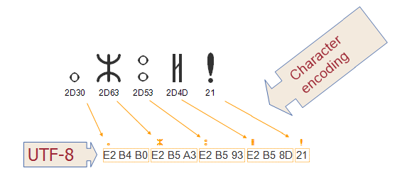

Useful​ ​resources
======

An HTML validator [can be found here](https://validator.w3.org/nu/). You'll want to use "check by file upload" or "check by text input" because your web pages are not visible on the internet for these exercises. They're only visible on your local machine.

[Mozilla Developer Network](https://developer.mozilla.org/en-US/) and [w3schools](https://www.w3schools.com/) are good resources for quickly learning the basics of HTML, CSS and many other web technologies from scratch. They are also useful as quick reference sites for if you want to know how to do something specific or if you've forgotten something.

For any web page on the internet you can usually view the HTML source. Looking at others' HTML is a good way to learn how others have achieved some tidy or nifty feature. In Firefox, Internet Explorer, Google Chrome and Opera, you can right-click and select the relevant option to view the page source (Source, View Source or View Page Source).

Previewing​ ​Web​ ​Content
=====

Using​ ​Windows​ ​Explorer
----

HTML files can be previewed from within windows explorer by double-clicking an HTML file to open it using the default web browser. If you wish to open the file with a specific browser, you can look to the ‘Using a web browser’ section, or alternatively, right-click on the file and find your desired browser in the ‘Open with’ menu.

Using​ ​a​ ​web​ ​browser
----

Most web browsers will allow you to open an HTML file by pressing `Ctrl+O`, then locating the HTML file you wish to view.

Using​ ​IntelliJ
----

Open the HTML file you wish to view in the IntelliJ window, then move your mouse to the top-right of the editor window. A row of browser icons should appear overlaid on the editor, which can be clicked to open the file in the desired editor.

Character​ ​Encodings
====
NOTE​: The following is excerpted from the w3c [Character encodings: Essential concepts page](https://www.w3.org/International/articles/definitions-characters/#charsets). 

A **character set** comprises the set of characters one might use for a particular purpose – be it those required to support Western European languages in computers, or those a Chinese child will learn at school in the third grade (nothing to do with computers). 

A **coded character set** is a set of characters for which a unique number has been assigned to each character. Units of a coded character set are known as code points. A code point value represents the position of a character in the coded character set. For example, the code point for the letter á in the Unicode coded character set is 225 in decimal. 

The **character encoding** reflects the way the *coded character set* is mapped to bytes for manipulation in a computer. The picture below shows how characters and code points in the Tifinagh (Berber) script are mapped to sequences of bytes in memory using the UTF-8 encoding. The code point values for each character are listed immediately below the glyph (ie. the visual representation) for that character at the top of the diagram. The arrows show how those are mapped to sequences of bytes, where each byte is represented by a two-digit hexadecimal number. Note how the Tifinagh code points map to three bytes, but the exclamation mark maps to a single byte.



The character encoding used in a web page needs to be communicated to the browser so that a page can be accurately displayed. With web browsers needing to deal with all sorts of languages from around the world, it is not clear what it should do with content if this information isn’t specified. Left to do whatever your browser has been set up to do ‘as default’ in such a situation can often lead to the wrong character encoding being chosen, leading to the malformed character appearing in the rendered HTML page - such as the `Ā` character being displayed as `A`, `?` or not being shown at all. You are able to select the Text Encoding that your browser will use to interpret your page, however this is not a reliable way to display your page, and you should instead use the appropriate tag in HTML to provide this information in an nambiguous way.

In modern web development, we should be using Unicode “UTF-8” as the character encoding for our documents. To indicate the following line into the <head> section of your HTML files:

```html
<meta charset="UTF-8">
```